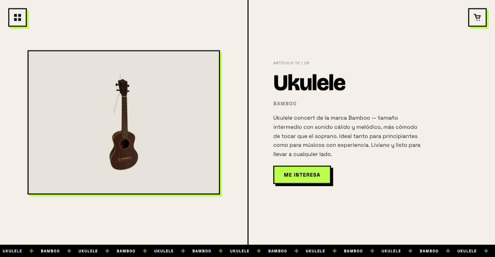

# Garage Sale

A single-page, full-screen catalogue for a personal moving sale. Items are
browsed one per viewport with snap scrolling, saved to a wishlist that survives
a page reload, and sent to the seller as a pre-filled WhatsApp message.

Built with [Astro](https://astro.build) and deployed to Cloudflare Workers.

**[→ Live demo](https://garage-sale.gian-olivieri.workers.dev/)**


Each item gets the full viewport — photo on the left, details and a one-tap
wishlist button on the right, with the item's own marquee running underneath.



## Features

- **Vertical snap-scroll catalogue** — 26 items, one per full-height slide,
  driven by CSS scroll snapping, with arrow-key navigation on top.
- **GSAP micro-interactions** — staggered hero intro timeline, elastic
  add-to-cart feedback, and animated cart-row removal.
- **Wishlist drawer** — item IDs persist in `localStorage` and broadcast a
  `cart:updated` event so every component stays in sync without a framework.
- **Thumbnail overview** — a floating grid for jumping straight to any item.
- **Sold state** — items flagged `sold` render a `VENDIDO` stamp and drop out
  of the wishlist flow.
- **Zero-JS baseline** — Astro ships static HTML; scripts are per-component
  islands, so the catalogue renders and scrolls before any JS loads.

## Stack

| | |
|---|---|
| Framework | Astro 6 (`output: "static"`) |
| Animation | GSAP 3 |
| Hosting | Cloudflare Workers via `@astrojs/cloudflare` |
| Language | TypeScript |
| Package manager | pnpm |

## Getting started

```bash
pnpm install
pnpm dev          # http://localhost:4321
```

| Script | Does |
|---|---|
| `pnpm dev` | Start the dev server |
| `pnpm build` | Build to `dist/` |
| `pnpm preview` | Serve the production build locally |
| `pnpm typecheck` | Run `astro check` |
| `pnpm deploy` | Deploy to Cloudflare Workers |

## Configuration

The WhatsApp destination is **not** committed. It is read at runtime from a
query parameter, so the deployed URL is shared as:

```
https://your-site.example/?phone=1234567890
```

Without `?phone=`, the wishlist still works — items can be browsed and saved —
but the contact button stays hidden.

## Adding items

Items live in [`src/data/items.json`](src/data/items.json) and are typed by
[`src/data/types.ts`](src/data/types.ts):

```json
{
  "id": "monitor-lg-4k",
  "name": "Monitor LG 4K",
  "brand": "LG 27UP650K-W",
  "description": "Monitor IPS de 27 pulgadas…",
  "image": "/images/monitor-lg-4k.png",
  "sold": false
}
```

Drop the matching image into `images/` (symlinked to `public/images/`) using
the item `id` as the filename. Copy is in Spanish.

## Project layout

```
src/
├── components/
│   ├── HeroSlide.astro      # Landing slide + intro timeline
│   ├── ItemSlide.astro      # One item, full viewport
│   ├── ThumbnailGrid.astro  # Jump-to-item overlay
│   ├── CartDrawer.astro     # Wishlist + WhatsApp handoff
│   └── MarqueeStrip.astro   # Looping text banner
├── data/
│   ├── items.json           # Catalogue content
│   ├── types.ts             # Item interface
│   └── cart.ts              # localStorage wishlist
├── layouts/BaseLayout.astro
└── pages/index.astro
claude_design/               # Original static mockup the build was derived from
images/                      # Exported item photos
```

`claude_design/` is the standalone HTML prototype used to settle the visual
language before the Astro build; it ships with its own design spec and is not
part of the application.

## License

[MIT](LICENSE)
